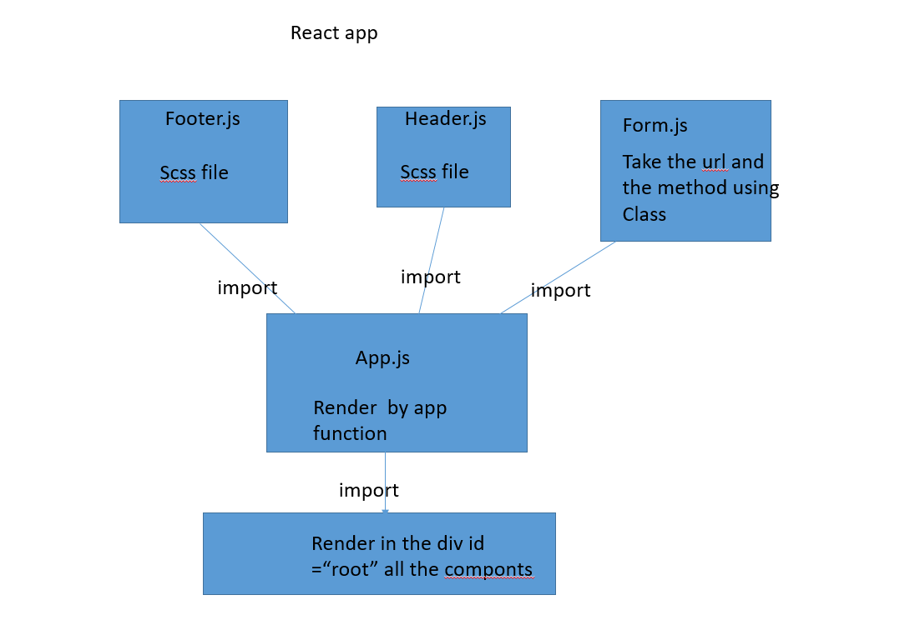

LAB - 9

Author: bayan alalem

Setup

`npx create-react-app my-app --use-npm ` `npm install node-sass@4.14.1` 

## detailes about files

### index.js
render the app.js function in the `
 root` block 

### app.js 

1- Create the function which render the main and footerand header fiels in the index.js ,
### form.js 
The `<Form>` component has:
Use it’s own .scss file for styling
Accept user input for a URL and store it in state
Allow the user to choose a method and store it in state
This can be done with radio buttons or clickable elements
Display the user’s choices on screen in a separate `
` .

### footer.js and  header.js 
Use it’s own .scss file for styling
and add some of text 

## Running the app

`npm start`

UML Diagram
