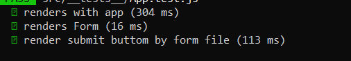
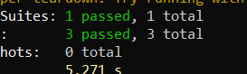
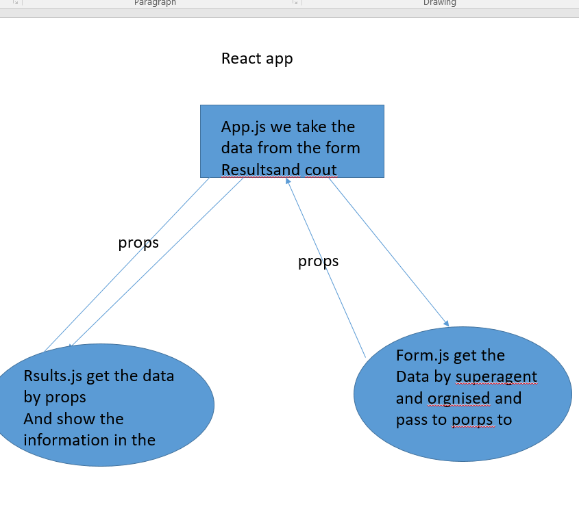

LAB - 9

Author: bayan alalem

Setup
ci/cd:!(https://bayan-97.github.io/myapp/)[]
`npx create-react-app my-app --use-npm ` `npm install node-sass@4.14.1` 

## detailes about files

### index.js
render the app.js function in the `
 root` block 

### app.js 

1- Create the function which render the form and results and footerand header  get all data from form as props update the state fiels in the index.js ,
### form.js 
The `<Form>` component has:
Use it’s own .scss file for styling
Accept user input for a URL and store it in state
Allow the user to choose a method and store it in state
This can be done with radio buttons or clickable elements
pass the value to app.js .

### results.js and  header.js 
Use it’s own .scss file for styling
and add some of text 
git all the data from app 
and render them 

## Running the app

`npm start`
test

UML Diagram
